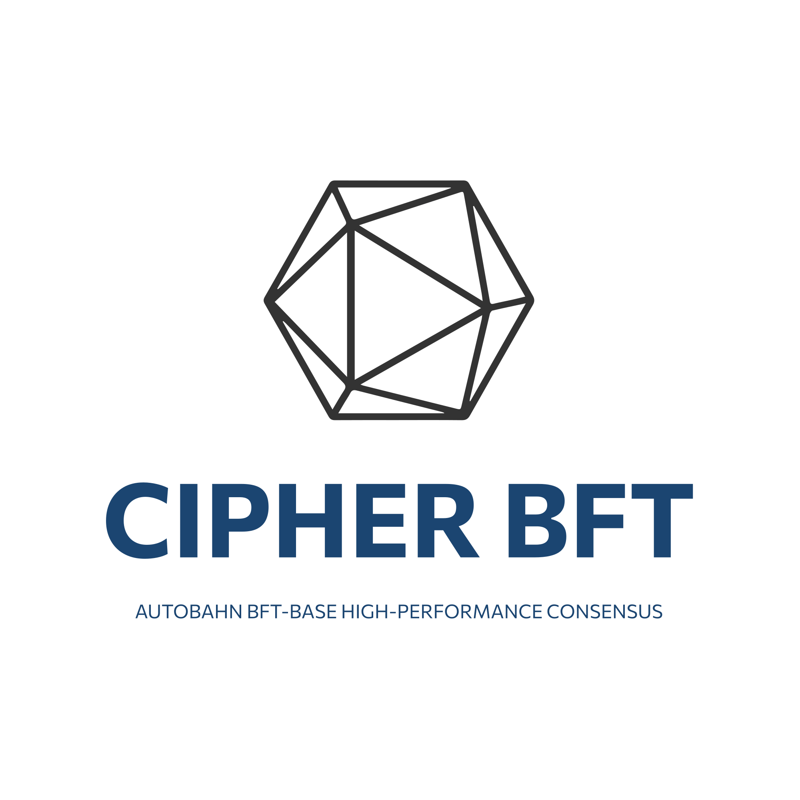
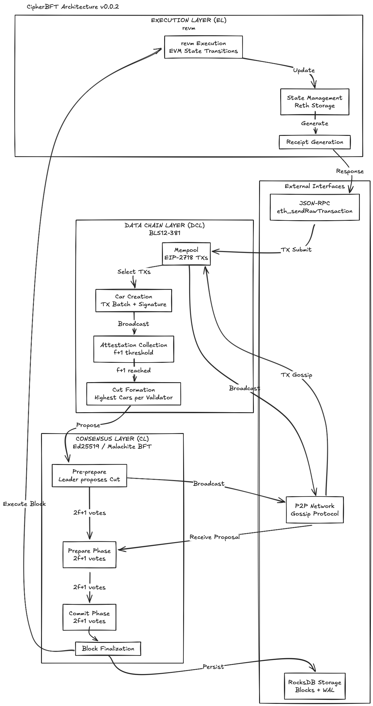
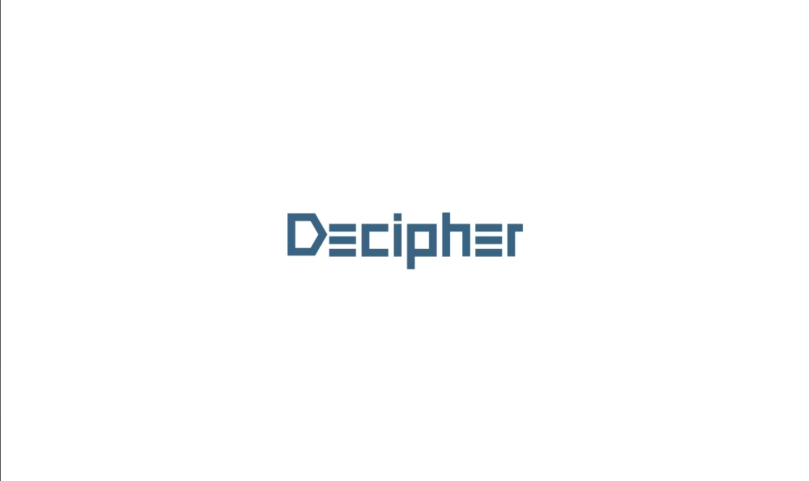

# Cipher BFT




**⚠️ Note: This project is currently under active development with a target completion date of Q1 2026.**

## Project Overview

**Cipher BFT** is a research initiative by [Decipher](#about-decipher) in collaboration with [B-Harvest](#about-b-harvest) to explore performance improvements in BFT consensus engines. This project serves as an academic exploration to analyze core functionalities and investigate how various algorithms and protocols could theoretically improve performance.

**Project Nature**: Pure research and exploratory project aimed at understanding performance bottlenecks in BFT consensus systems and evaluating potential optimization approaches.

**Status**: Currently under active development with a target completion date of Q1 2026. Decipher and B-Harvest are collaborating on this research initiative, combining Decipher's academic research capabilities with B-Harvest's deep technical expertise in validator operations and blockchain infrastructure.

## Research Motivation

This research explores areas that can be further optimized in BFT consensus systems:

- Consensus layer architecture for higher throughput and better resilience
- P2P communication efficiency and message propagation patterns
- Transaction processing throughput and execution layer optimization
- Recovery mechanisms after network disruptions

By exploring alternative consensus algorithms like **Autobahn BFT** and optimizing P2P communication protocols, this research investigates how a BFT Consensus Engine could provide extreme performance while fully leveraging Rust's advantages.

## Implementation Approach

### Three-Layer Architecture (DCL/CL/EL)



CipherBFT implements Autobahn BFT's three-layer separation:

- **Data Chain Layer (DCL)**: Car creation, BLS attestations (f+1), Cut formation
- **Consensus Layer (CL)**: PBFT consensus via Malachite (Ed25519 signatures)
- **Execution Layer (EL)**: Transaction execution via embedded revm with Reth storage

**Key Insight**: Consensus-then-Execute model. Unlike Engine API's execute-then-consensus approach, Autobahn BFT reaches consensus on transaction ordering (Cut) before execution.

```
Engine API:     Proposer executes → state_root in proposal → Consensus on result
Autobahn BFT:   All validators create Cars → Consensus on Cut → Execute → state_root in commit
```

### Autobahn BFT Consensus

Autobahn achieves lower latency than DAG-based protocols through:

- **5 delta latency** (vs Narwhal's 9 delta, Bullshark's 7 delta)
- **f+1 attestations** for data availability (vs 2f+1 in Narwhal)
- **Linear lanes** instead of DAG (no garbage collection complexity)
- **Pipelining**: Attestation collection for height N+1 during consensus on height N

### Dual Signature Scheme

- **Ed25519**: Consensus Layer votes/proposals (Malachite native)
- **BLS12-381**: Data Chain Layer attestations (aggregatable, 8x bandwidth reduction)

### Performance Targets

| Metric | Target | Conditions |
|--------|--------|------------|
| Throughput | >100K TPS | n=21 validators, 4 workers |
| Latency (p50) | <500ms | geo-distributed (3 regions) |
| Latency (p99) | <1s | geo-distributed |
| vs Bullshark | 2x latency improvement | identical conditions |

## Getting Started

### Prerequisites

- **Rust**: 1.75+ (install via [rustup](https://rustup.rs/))
- **Processor**: x86_64 architecture recommended
- **Cores**: 4+ physical cores recommended
- **RAM**: 8GB minimum, 16GB recommended
- **Storage**: 20+ GB available space
- **OS**: Linux (Ubuntu 22.04+ recommended) or macOS (12+)

### System Dependencies

**Ubuntu/Debian**:
```bash
sudo apt-get update
sudo apt-get install -y build-essential pkg-config libssl-dev clang cmake
```

**macOS**:
```bash
brew install cmake openssl
```

### Build from Source

```bash
# Clone repository
git clone https://github.com/decipherhub/cipherbft.git
cd cipherbft

# Build in release mode
cargo build --release

# Run tests
cargo test
```

### Development Status

> **Note**: CipherBFT is currently in the design phase. All ADRs are in PROPOSED status. See [Architecture Decision Records](./docs/architecture/README.md) for detailed design documentation.

## Architecture

CipherBFT implements a three-layer architecture with Primary-Worker scaling:

```
┌─────────────────────────────────────────────────────────────────────────────┐
│                           CipherBFT Validator Node                          │
├─────────────────────────────────────────────────────────────────────────────┤
│                                                                             │
│  ┌────────────────────────────────────────────────────────────────────┐    │
│  │                      PRIMARY PROCESS (1-2 cores)                    │    │
│  │                                                                      │    │
│  │   ┌─────────────┐    ┌─────────────┐    ┌─────────────────────┐    │    │
│  │   │     DCL     │    │     CL      │    │         EL          │    │    │
│  │   │             │    │             │    │                     │    │    │
│  │   │ Car/Cut     │───▶│  Malachite  │───▶│   Embedded revm     │    │    │
│  │   │ BLS Attestn │    │  PBFT       │    │   Reth Storage      │    │    │
│  │   │             │    │  Ed25519    │    │   (MDBX)            │    │    │
│  │   └─────────────┘    └─────────────┘    └─────────────────────┘    │    │
│  │                                                                      │    │
│  └────────────────────────────────────────────────────────────────────┘    │
│                                    │                                        │
│                          tokio mpsc channels                                │
│                                    │                                        │
│  ┌────────────────────────────────▼───────────────────────────────────┐    │
│  │                     WORKER PROCESSES (1-8 cores)                    │    │
│  │                                                                      │    │
│  │   ┌──────────┐  ┌──────────┐  ┌──────────┐  ┌──────────┐          │    │
│  │   │ Worker 0 │  │ Worker 1 │  │ Worker 2 │  │ Worker 3 │          │    │
│  │   │ Batch TX │  │ Batch TX │  │ Batch TX │  │ Batch TX │          │    │
│  │   │ Broadcast│  │ Broadcast│  │ Broadcast│  │ Broadcast│          │    │
│  │   └──────────┘  └──────────┘  └──────────┘  └──────────┘          │    │
│  │                                                                      │    │
│  └────────────────────────────────────────────────────────────────────┘    │
│                                                                             │
│  ┌────────────────────────────────────────────────────────────────────┐    │
│  │  P2P Network (libp2p/QUIC) │ JSON-RPC API │ Mempool (Reth TxPool) │    │
│  └────────────────────────────────────────────────────────────────────┘    │
│                                                                             │
└─────────────────────────────────────────────────────────────────────────────┘
```

### Transaction Flow: Consensus-then-Execute

```
1. USER          2. MEMPOOL        3. DCL           4. DCL           5. CL            6. EL
┌─────────┐     ┌──────────┐     ┌──────────┐     ┌──────────┐     ┌──────────┐     ┌──────────┐
│eth_send │────▶│ Validate │────▶│Create Car│────▶│Collect   │────▶│PBFT on   │────▶│ Execute  │
│RawTx    │     │ Queue    │     │Broadcast │     │f+1 Attest│     │Cut       │     │ Compute  │
└─────────┘     └──────────┘     └──────────┘     │Form Cut  │     │(Malachite│     │state_root│
                                                  └──────────┘     └──────────┘     └──────────┘
                                                                                          │
                                                  7. COMMIT: state_root in commit certificate
```

## Key Components

| Crate | Purpose |
|-------|---------|
| **types** | Core types: Hash, Height, ValidatorId, Car, Cut, Attestation |
| **crypto** | Dual signatures: Ed25519 (Malachite) + BLS12-381 (blst) |
| **data-chain** | DCL: Car creation, attestation collection, Cut formation |
| **consensus** | CL: Malachite PBFT integration, effect handlers |
| **execution** | EL: Embedded revm, Reth crate integration |
| **mempool** | Transaction pool: Reth TxPool integration |
| **worker** | Primary-Worker architecture, batch dissemination |
| **storage** | Reth-db (MDBX), WAL, consensus state |
| **network** | P2P: libp2p with QUIC transport |
| **sync** | State synchronization (Snap Sync, Checkpoint Sync) |
| **rpc** | JSON-RPC 2.0 (Ethereum-compatible) |
| **node** | Node orchestration, startup |
| **cipherbft** | Main binary, CLI |

## About B-Harvest


B-Harvest is a leading blockchain infrastructure company and validator operator founded in 2018, with deep roots in the Cosmos ecosystem.

**Core Expertise**:
- Operating validators across 20+ blockchain networks
- Managing $300M+ in staked assets with 16,000+ delegators
- Core development on Tendermint/CometBFT-based blockchains
- DeFi protocol development (Crescent, Gravity DEX, etc.)

Website: [bharvest.io](https://bharvest.io/)

## About Decipher



Decipher is the leading blockchain research group at Seoul National University and one of Korea's premier blockchain academic communities.

**Mission**:
- Advancing blockchain technology through cutting-edge research
- Education and knowledge dissemination in Korean
- Building Korea's blockchain ecosystem

**Activities**:
- Core protocol research and development
- Industry collaboration and partnerships
- Community building through conferences and events

Website: [decipher.ac](https://decipher.ac/)

## Research Goals

- Document theoretical and practical implications of consensus algorithm replacements
- Measure performance improvements in real-world conditions
- Contribute to academic understanding of BFT consensus optimization
- Provide open-source implementations for community evaluation
- Validate Autobahn BFT worker scaling empirically

## Contributing

This is an academic research project. We welcome:
- Performance analysis and benchmarking contributions
- Algorithm implementation improvements
- Documentation and educational content
- Bug reports and security findings

Please see [CONTRIBUTING.md](CONTRIBUTING.md) for detailed guidelines.

## License

Licensed under the [MIT License](LICENSE).

## References

- [Autobahn: Seamless high speed BFT (SOSP '24)](https://arxiv.org/abs/2401.10369)
- [Narwhal and Tusk (EuroSys '22)](https://arxiv.org/abs/2105.11827)
- [Malachite Consensus](https://github.com/informalsystems/malachite)
- [Reth Documentation](https://reth.rs)
- [revm - Rust EVM](https://github.com/bluealloy/revm)

---

*Cipher BFT is a research collaboration between Decipher and B-Harvest, exploring the frontiers of high-performance consensus mechanisms.*

**Status**: Design Phase (All ADRs PROPOSED) | [Architecture Docs](./docs/architecture/README.md)
