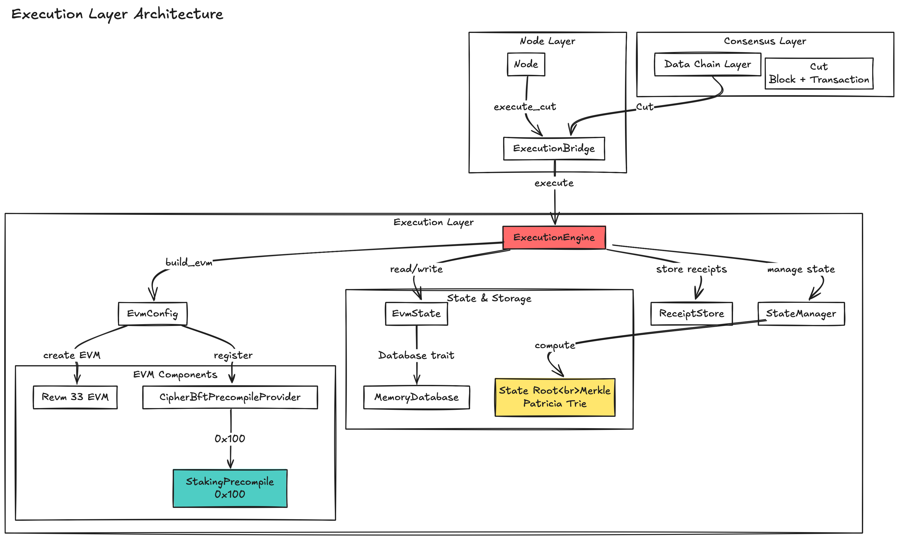
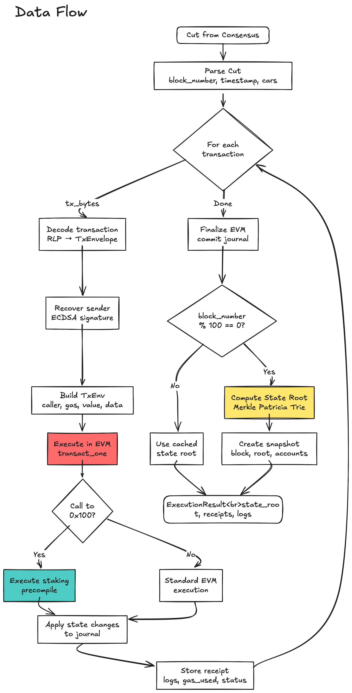

# Execution Layer 설계 문서

## Overview

CipherBFT의 Execution Layer는 revm 기반의 EVM 실행 환경을 제공하며, Consensus Layer로부터 전달받은 Transaction을 실행하고 State를 관리합니다. Revm 33과 Alloy 1.x를 기반으로 구현되었으며, Custom Staking Precompile (0x100)을 통해 Validator 관리 기능을 제공합니다.

## Related ADRs

- [ADR-002: EVM Native Execution](../../docs/architecture/adr-002-evm-native-execution.md) - EVM Execution Layer 아키텍처
- [ADR-009: Staking Precompile](../../docs/architecture/adr-009-staking-precompile.md) - Validator 관리를 위한 Custom Precompile
- [ADR-012: State Root Handling](../../docs/architecture/adr-012-state-root-handling.md) - State Root 계산 및 Checkpoint

## Architecture

<p align="center">
  
</p>

## Data Flow

<p align="center">
  
</p>

## Core Components

### 1. ExecutionLayer (`src/layer.rs`)

메인 Execution Layer 구조체로, Cut 실행과 State 관리를 담당합니다.

**주요 기능:**
- Cut 실행: `execute_cut()` - Consensus Layer로부터 받은 Cut의 모든 Transaction을 순서대로 실행
- Transaction Validation: `validate_transaction()` - Transaction을 실행 전 검증
- State Commit: Cut 실행 후 State를 영구 저장소에 기록

**핵심 구현:**
```rust
pub fn execute_cut(&mut self, cut: Cut) -> Result<ExecutionResult> {
    // 1. EVM 구성 (Context API)
    let mut evm = self.evm_config.build_evm_with_precompiles(
        &mut self.state.db,
        block_number,
        timestamp,
        Arc::clone(&self.staking_precompile),
    );

    // 2. 각 Car의 Transaction 실행
    for car in cut.cars {
        for tx_bytes in car.transactions {
            // CRITICAL: transact_one() 사용 - journal state 보존
            let result = self.evm_config.execute_transaction(&mut evm, &tx_bytes)?;
            receipts.push(result.receipt);
            gas_used += result.gas_used;
        }
    }

    // 3. State Root 계산 (100 block마다)
    let state_root = if self.state.should_compute_state_root(block_number) {
        self.state.compute_state_root(block_number)?
    } else {
        B256::ZERO
    };

    // 4. State Commit
    self.state.commit()?;

    Ok(ExecutionResult { state_root, receipts, gas_used })
}
```

### 2. EvmConfig (`src/evm.rs`)

EVM 인스턴스 생성 및 Transaction 실행을 관리합니다.

**주요 특징:**
- **Revm 33 Context API**: `Env` 대신 `Context` 기반 API 사용
- **Custom Precompile Provider**: Staking precompile (0x100)과 표준 precompile 통합
- **Journal State Preservation**: `transact_one()` 사용으로 nonce 증가 등 state 변경 보존

**Security:**
- Gas limit 강제로 무한 루프 방지
- Nonce 검증으로 재전송 공격 차단
- 서명 검증으로 Transaction 위조 방지
- Revert 처리로 실패한 Transaction의 state 변경 rollback

**핵심 구현:**
```rust
pub fn build_evm_with_precompiles<'a, DB>(
    &self,
    database: &'a mut DB,
    block_number: u64,
    timestamp: u64,
    staking_precompile: Arc<RwLock<StakingPrecompile>>,
) -> Evm<'a, (), &'a mut DB, CipherBftPrecompileProvider>
where
    DB: Database + DatabaseCommit,
{
    // Context 생성
    let mut ctx: Context<(), &mut DB> = Context::new(database, self.spec_id);

    // Block context 설정
    ctx.block.number = alloy_primitives::U256::from(block_number);
    ctx.block.timestamp = alloy_primitives::U256::from(timestamp);
    ctx.cfg.chain_id = self.chain_id;

    // Custom Precompile Provider 생성
    let custom_precompiles = CipherBftPrecompileProvider::new(
        staking_precompile,
        self.spec_id,
    );

    Evm {
        ctx,
        inspector: (),
        instruction: EthInstructions::default(),
        handler: EvmHandler::new(custom_precompiles),
        db_tx: PhantomData,
    }
}

pub fn execute_transaction<EVM>(&self, evm: &mut EVM, tx_bytes: &Bytes)
    -> Result<TransactionResult>
where
    EVM: EvmTx<&mut dyn Database, CipherBftPrecompileProvider>,
{
    // Transaction 디코딩
    let tx_env = self.decode_transaction(tx_bytes)?;

    // CRITICAL: transact_one() 사용
    // - transact()는 매 호출마다 journal 초기화
    // - transact_one()은 journal state 보존 (nonce 증가 등)
    let result = evm.transact_one(tx_env)
        .map_err(|e| ExecutionError::EvmError(format!("EVM execution failed: {:?}", e)))?;

    self.process_execution_result(result, tx_hash, sender, to)
}
```

### 3. StateManager (`src/state.rs`)

State 관리 및 State Root 계산을 담당합니다.

**주요 기능:**
- State Root 계산: 100 block마다 Merkle Patricia Trie 계산
- State Commit: 변경사항을 RocksDB에 영구 저장
- Account State 관리: 잔액, nonce, 코드, storage 관리
- Rollback 지원: Snapshot 기반 state 복원

**Security:**
- Atomic commit으로 state 일관성 보장
- State root 검증으로 state 무결성 확인
- Snapshot 기반 rollback으로 장애 복구 지원

**State Root Interval (Protocol 상수):**
```rust
/// State root computation interval - MUST NOT BE CHANGED
/// All validators must use the same interval for consensus
pub const STATE_ROOT_SNAPSHOT_INTERVAL: u64 = 100;

impl StateManager {
    pub fn should_compute_state_root(&self, block_number: u64) -> bool {
        block_number > 0 && block_number % STATE_ROOT_SNAPSHOT_INTERVAL == 0
    }

    pub fn compute_state_root(&self, block_number: u64) -> Result<B256> {
        tracing::debug!(
            block_number,
            "Computing state root (checkpoint interval: {})",
            STATE_ROOT_SNAPSHOT_INTERVAL
        );

        // Merkle Patricia Trie 계산
        let root = self.db.merkle_root()?;

        tracing::info!(
            block_number,
            state_root = %root,
            "State root computed"
        );

        Ok(root)
    }
}
```

**중요:** `STATE_ROOT_SNAPSHOT_INTERVAL`은 Consensus Protocol의 일부로, **모든 Validator가 동일한 값을 사용해야 합니다**. 이 값을 변경하면 consensus 불일치가 발생합니다.

### 4. Staking Precompile (`src/precompiles/staking.rs`)

Validator 관리를 위한 Custom Precompile (주소: 0x100)

**Function Selectors (Alloy 1.x):**
```rust
// registerValidator(bytes) - 0x607049d8
// deregisterValidator() - 0x6a911ccf
// getValidatorSet() - 0xcf331250
// getStake(address) - 0x08c36874
// slash(address,uint256) - 0xd8fe7642
```

**핵심 기능:**
- **registerValidator**: Validator 등록 (최소 1 ETH staking)
- **deregisterValidator**: Validator 등록 해제
- **getValidatorSet**: 활성 Validator 목록 조회
- **getStake**: 특정 Validator의 staking 양 조회
- **slash**: Validator slashing (System address만 호출 가능)

**Security:**
```rust
pub const MIN_VALIDATOR_STAKE: u128 = 1_000_000_000_000_000_000; // 1 ETH
pub const SYSTEM_ADDRESS: Address = address!("0000000000000000000000000000000000000000");

fn slash(&mut self, validator: Address, amount: U256, caller: Address) -> Result<Bytes> {
    // System address만 slashing 가능
    if caller != SYSTEM_ADDRESS {
        return Err(PrecompileError::Fatal(
            "Only system can slash".to_string()
        ));
    }

    // 현재 staking에서 차감
    let remaining = current_stake.saturating_sub(amount);
    if remaining < MIN_VALIDATOR_STAKE {
        self.validators.remove(&validator);
    }
    // ...
}
```

- 최소 staking 요구사항 (1 ETH)으로 Sybil attack 방지
- Slashing은 system address만 가능하여 악의적 slashing 차단
- 입력 검증 및 에러 처리로 잘못된 데이터 차단

### 5. CipherBftPrecompileProvider (`src/precompiles/provider.rs`)

Precompile 호출을 routing합니다.

**동작 방식:**
```rust
impl PrecompileProvider for CipherBftPrecompileProvider {
    fn get_precompile(&self, address: &Address, _context: &PrecompileContext)
        -> Option<Precompile>
    {
        if address == &STAKING_PRECOMPILE_ADDRESS {
            // 0x100: Custom Staking Precompile
            Some(Precompile::Stateful(Arc::new(
                move |input: &Bytes, gas_limit: u64, context: &PrecompileContext| {
                    let mut precompile = staking_precompile.blocking_write();
                    precompile.execute(input, gas_limit, context)
                }
            )))
        } else {
            // 0x01-0x0a: Standard Precompiles
            self.default_precompiles.get_precompile(address, _context)
        }
    }
}
```

## Consensus Layer Integration

### ExecutionBridge (`crates/node/src/execution_bridge.rs`)

Consensus Layer와 Execution Layer 간 bridge 역할을 수행합니다.

**주요 역할:**
1. **Cut Conversion**: Consensus Cut → Execution Cut
2. **Transaction Validation**: Mempool CheckTx 지원
3. **Cut Execution**: Execution Layer 호출 및 결과 반환

**사용 예시:**
```rust
// Node에서 ExecutionBridge 활성화
let node = Node::new(config)?
    .with_execution_layer()?;

// Cut 실행
match bridge.execute_cut(cut).await {
    Ok(result) => {
        info!(
            "Cut executed - state_root: {}, gas_used: {}",
            result.state_root,
            result.gas_used
        );
    }
    Err(e) => error!("Cut execution failed: {}", e),
}
```

## Performance Considerations

### State Root 계산

**100 block 간격 선택 이유:**
- **Performance**: Merkle Patricia Trie 계산은 state 크기에 따라 비용이 증가
- **Checkpoint**: Rollback 및 state 검증을 위한 주기적 snapshot
- **Consensus**: 모든 Validator가 동일한 block에서 state root 계산 필요

**향후 최적화:**
- State 크기가 큰 경우 계산 비용 측정
- Incremental MPT 구현 고려
- 병렬 계산 가능성 검토

### Transaction 실행

**Performance 특징:**
- `transact_one()` 사용으로 journal overhead 최소화
- Context API로 불필요한 복사 제거
- Precompile 호출 최적화 (Arc<RwLock> 사용)

## TODO

1. **Batch Lookup Integration:**
   - ExecutionBridge의 `convert_cut()`에서 실제 batch 데이터 가져오기
   - Worker storage와 통합

2. **Parent Hash Tracking:**
   - Block chain 연결성을 위한 parent hash 관리
   - 재구성 시 검증 지원

3. **Performance Optimization:**
   - State root 계산 최적화
   - Incremental MPT 구현
   - 병렬 transaction 검증

4. **Enhanced Monitoring:**
   - 상세 metrics 수집
   - Performance profiling

## References

- **Revm 33 Documentation**: https://docs.rs/revm/33.0.0
- **Alloy 1.x**: https://docs.rs/alloy/1.0.0
- **ADR-002**: EVM Native Execution
- **ADR-009**: Staking Precompile
- **ADR-012**: State Root Handling
