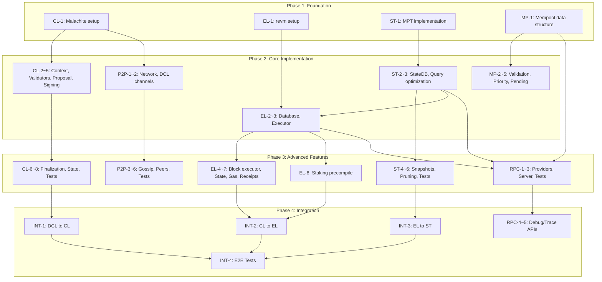

# CipherBFT Development Tasks

This document outlines all development tasks required to complete the CipherBFT implementation.

**LOC Estimation**: See [cipherbft-estimation](https://github.com/qj0r9j0vc2/cipherbft-estimation) for measurement methodology and reference data.

## Overview

| Component | Tasks | Estimated LOC | Core Dependencies |
|:----------|:------|:--------------|:------------------|
| CL (Consensus Layer) | 8 | ~4,000 | DCL |
| EL (Execution Layer) | 9 | ~6,000 | ST |
| ST (Storage Layer) | 6 | ~3,500 | None |
| P2P (Networking) | 6 | ~3,000 | CL |
| MP (Mempool) | 6 | ~2,000 | EL |
| RPC (JSON-RPC API) | 3 (+2 optional) | ~1,500 (+2,000) | ST, EL, MP |
| INT (Integration) | 4 | ~2,000 | All |
| **Total** | **42 (+2)** | **~22,000 (+2,000)** | - |

Note: RPC layer reuses Reth's RPC handlers, significantly reducing implementation effort. Optional RPC tasks (debug/trace, proof) add ~2,000 LOC if needed.

## Difficulty Legend

- [Easy] - Straightforward implementation with clear patterns
- [Medium] - Requires understanding of domain concepts
- [Hard] - Complex logic or multiple subsystem coordination
- [Very Hard] - Critical path, requires deep expertise

---

## 1. Consensus Layer (CL) - Malachite Integration

Integrate [Malachite](https://github.com/informalsystems/malachite) consensus engine for BFT consensus.

**Reference Implementation**: [Malachite Example Node](https://github.com/informalsystems/malachite/tree/main/code/examples/channel)

| ID | Task | Dependencies | Est. LOC | Difficulty | Status |
|:---|:-----|:-------------|:---------|:-----------|:-------|
| CL-1 | Add Malachite dependencies and build configuration | None | 200 | [Easy] | [ ] |
| CL-2 | Implement ConsensusContext trait | CL-1 | 800 | [Hard] | [ ] |
| CL-3 | Validator set management (VotingPowerReader) | CL-1 | 500 | [Medium] | [ ] |
| CL-4 | Implement ProposalBuilder (DCL Car-based) | CL-2, DCL | 600 | [Hard] | [ ] |
| CL-5 | Vote signing/verification (Ed25519) | CL-2 | 400 | [Medium] | [ ] |
| CL-6 | Block finalization logic | CL-4, CL-5 | 700 | [Hard] | [ ] |
| CL-7 | Height/Round state management | CL-6 | 300 | [Medium] | [ ] |
| CL-8 | Malachite test harness | CL-1~7 | 500 | [Medium] | [ ] |

### CL Task Details

#### CL-1: Add Malachite dependencies and build configuration

**Estimated LOC**: 200

**Rationale**: Cargo.toml modifications (~50 LOC), feature flag configuration (~50 LOC), re-exports and module setup (~100 LOC). Based on [Malachite's own Cargo.toml structure](https://github.com/informalsystems/malachite/blob/main/code/crates/app/Cargo.toml).

**Work Items**:
- Add `malachite-consensus`, `malachite-app`, `malachite-actors` to Cargo.toml
- Configure feature flags for signing backends
- Create `crates/consensus/` module structure
- Verify build succeeds with all dependencies

**References**:
- [Malachite Crates](https://github.com/informalsystems/malachite/tree/main/code/crates)
- [malachite-app Cargo.toml](https://github.com/informalsystems/malachite/blob/main/code/crates/app/Cargo.toml)

---

#### CL-2: Implement ConsensusContext trait

**Estimated LOC**: 800

**Rationale**: The `Context` trait requires implementing 8+ associated types and their trait bounds. Based on [Malachite's Context trait](https://github.com/informalsystems/malachite/blob/main/code/crates/core-types/src/context.rs) (~150 LOC for trait definition), each type implementation averages ~80 LOC including tests.

**Work Items**:
- Implement `malachite_core_types::Context` trait
- Define `Height` type (wrapper around u64)
- Define `Round` type (wrapper around i64)
- Define `Value` type (block hash or Car reference)
- Define `Address` type (validator identifier)
- Define `ProposalPart` type for streaming proposals
- Define `Vote` type with signing support
- Implement all required trait bounds (Eq, Hash, Ord, etc.)

**References**:
- [Malachite Context Trait](https://github.com/informalsystems/malachite/blob/main/code/crates/core-types/src/context.rs)
- [Example Context Implementation](https://github.com/informalsystems/malachite/blob/main/code/crates/test/src/context.rs)
- [Starknet Context (Production Example)](https://github.com/informalsystems/malachite/blob/main/code/crates/starknet/host/src/types/context.rs)

---

#### CL-3: Validator set management (VotingPowerReader)

**Estimated LOC**: 500

**Rationale**: ValidatorSet struct (~100 LOC), VotingPowerReader trait implementation (~150 LOC), validator updates handling (~150 LOC), tests (~100 LOC). Reference: [Malachite VotingPower](https://github.com/informalsystems/malachite/blob/main/code/crates/core-types/src/voting_power.rs).

**Work Items**:
- Implement `ValidatorSet` struct with voting power tracking
- Implement `VotingPowerReader` trait
- Calculate total voting power and quorum thresholds
- Handle validator set updates (add/remove/update power)
- Integrate with staking state from EL

**References**:
- [Malachite VotingPower](https://github.com/informalsystems/malachite/blob/main/code/crates/core-types/src/voting_power.rs)
- [ValidatorSet in Test](https://github.com/informalsystems/malachite/blob/main/code/crates/test/src/validator_set.rs)

---

#### CL-4: Implement ProposalBuilder (DCL Car-based)

**Estimated LOC**: 600

**Rationale**: ProposalBuilder trait implementation (~200 LOC), Car aggregation logic (~200 LOC), proposal streaming with ProposalPart (~200 LOC). Must coordinate with existing DCL Car types in [`crates/data-chain/src/car.rs`](https://github.com/decipherhub/cipherbft/blob/main/crates/data-chain/src/car.rs).

**Work Items**:
- Implement `ProposalBuilder` trait from Malachite
- Aggregate finalized Cars from DCL into proposals
- Include aggregated attestations in proposal
- Support proposal streaming via `ProposalPart` for large blocks
- Handle proposal validation

**References**:
- [Malachite ProposalBuilder](https://github.com/informalsystems/malachite/blob/main/code/crates/app/src/proposal.rs)
- [CipherBFT Car Type](https://github.com/decipherhub/cipherbft/blob/main/crates/data-chain/src/car.rs)
- [Streaming Proposals ADR](https://github.com/informalsystems/malachite/blob/main/docs/architecture/adr-003-proposal-streaming.md)

---

#### CL-5: Vote signing/verification (Ed25519)

**Estimated LOC**: 400

**Rationale**: Signer implementation (~100 LOC), Verifier implementation (~100 LOC), vote type definitions (~100 LOC), signature aggregation helpers (~100 LOC). CipherBFT already has Ed25519 in [`crates/crypto/`](https://github.com/decipherhub/cipherbft/tree/main/crates/crypto).

**Work Items**:
- Implement `Signer` trait using existing Ed25519 primitives
- Implement `Verifier` trait for vote verification
- Define `SignedVote` type with signature
- Handle prevote and precommit signing
- Integrate with existing crypto module

**References**:
- [Malachite Signing Traits](https://github.com/informalsystems/malachite/blob/main/code/crates/core-types/src/signing.rs)
- [Ed25519 Signing Scheme](https://github.com/informalsystems/malachite/blob/main/code/crates/signing-ed25519/src/lib.rs)
- [CipherBFT Crypto Module](https://github.com/decipherhub/cipherbft/tree/main/crates/crypto)

---

#### CL-6: Block finalization logic

**Estimated LOC**: 700

**Rationale**: Decided value handler (~200 LOC), block construction from proposals (~200 LOC), commit certificate handling (~150 LOC), finalization event emission (~150 LOC). Core consensus-to-execution bridge.

**Work Items**:
- Handle `Decided` output from consensus
- Construct finalized block from proposal parts
- Create commit certificate with aggregated signatures
- Emit finalization events for EL
- Persist finalized block to storage
- Handle edge cases (empty blocks, timeouts)

**References**:
- [Malachite Consensus Output](https://github.com/informalsystems/malachite/blob/main/code/crates/core-consensus/src/output.rs)
- [Host Actor Finalization](https://github.com/informalsystems/malachite/blob/main/code/crates/actors/src/host.rs)

---

#### CL-7: Height/Round state management

**Estimated LOC**: 300

**Rationale**: State struct (~50 LOC), persistence layer (~100 LOC), recovery logic (~100 LOC), tests (~50 LOC). Critical for crash recovery.

**Work Items**:
- Track current height and round in persistent storage
- Handle height advancement after finalization
- Handle round advancement on timeout
- Implement crash recovery (resume from last known state)
- Manage timeout scheduling

**References**:
- [Malachite State Management](https://github.com/informalsystems/malachite/blob/main/code/crates/core-consensus/src/state.rs)
- [Tendermint Consensus State](https://github.com/cometbft/cometbft/blob/main/consensus/state.go)

---

#### CL-8: Malachite test harness

**Estimated LOC**: 500

**Rationale**: Test fixtures (~150 LOC), unit tests (~200 LOC), integration tests with mock network (~150 LOC). Based on [Malachite's test infrastructure](https://github.com/informalsystems/malachite/tree/main/code/crates/test).

**Work Items**:
- Create test context with mock validators
- Unit tests for each trait implementation
- Integration tests with in-memory network
- Liveness tests (blocks finalize under normal conditions)
- Safety tests (no conflicting blocks finalized)

**References**:
- [Malachite Test Crate](https://github.com/informalsystems/malachite/tree/main/code/crates/test)
- [Malachite Integration Tests](https://github.com/informalsystems/malachite/tree/main/code/crates/actors/src/util/tests)

---

## 2. Execution Layer (EL) - revm Integration

Integrate [revm](https://github.com/bluealloy/revm) for EVM execution.

**Reference Implementation**: [Reth Execution](https://github.com/paradigmxyz/reth/tree/main/crates/evm)

| ID | Task | Dependencies | Est. LOC | Difficulty | Status |
|:---|:-----|:-------------|:---------|:-----------|:-------|
| EL-1 | Add revm dependencies and configuration | None | 150 | [Easy] | [ ] |
| EL-2 | Implement EVM Database trait | EL-1, ST-2 | 600 | [Hard] | [ ] |
| EL-3 | Implement transaction executor | EL-2 | 800 | [Hard] | [ ] |
| EL-4 | Block executor (batch processing) | EL-3 | 700 | [Hard] | [ ] |
| EL-5 | State transition verification | EL-4 | 500 | [Hard] | [ ] |
| EL-6 | Gas metering and limit handling | EL-3 | 400 | [Medium] | [ ] |
| EL-7 | Receipt/Log generation | EL-4 | 350 | [Medium] | [ ] |
| EL-8 | Staking precompile (0x80) | EL-3 | 1,500 | [Very Hard] | [ ] |
| EL-9 | EVM test suite | EL-1~8 | 1,000 | [Medium] | [ ] |

### EL Task Details

#### EL-1: Add revm dependencies and configuration

**Estimated LOC**: 150

**Rationale**: Cargo.toml additions (~30 LOC), EVM configuration struct (~50 LOC), chain spec setup (~70 LOC).

**Work Items**:
- Add `revm` crate with `std` and `serde` features
- Add `alloy-primitives` for Ethereum types
- Configure EVM for custom chain (chain ID, spec version)
- Set up hardfork configuration (target Cancun or later)

**References**:
- [revm Cargo.toml](https://github.com/bluealloy/revm/blob/main/Cargo.toml)
- [revm Features](https://github.com/bluealloy/revm/blob/main/crates/revm/Cargo.toml)
- [Reth EVM Config](https://github.com/paradigmxyz/reth/blob/main/crates/evm/src/lib.rs)

---

#### EL-2: Implement EVM Database trait

**Estimated LOC**: 600

**Rationale**: Database trait implementation (~200 LOC), account loading (~150 LOC), storage loading (~150 LOC), code loading (~100 LOC). The [revm Database trait](https://github.com/bluealloy/revm/blob/main/crates/primitives/src/db.rs) requires 4 methods.

**Work Items**:
- Implement `revm::Database` trait
- Implement `basic(address)` - load account info
- Implement `code_by_hash(hash)` - load contract code
- Implement `storage(address, slot)` - load storage value
- Implement `block_hash(number)` - load block hash
- Connect to Storage Layer (ST) backend

**References**:
- [revm Database Trait](https://github.com/bluealloy/revm/blob/main/crates/primitives/src/db.rs)
- [revm EmptyDB Example](https://github.com/bluealloy/revm/blob/main/crates/primitives/src/db/empty_db.rs)
- [Reth StateProvider](https://github.com/paradigmxyz/reth/blob/main/crates/storage/provider/src/traits/state.rs)

---

#### EL-3: Implement transaction executor

**Estimated LOC**: 800

**Rationale**: Transaction decoding (~100 LOC), EVM setup per tx (~150 LOC), execution loop (~200 LOC), result handling (~150 LOC), error mapping (~100 LOC), tests (~100 LOC).

**Work Items**:
- Decode RLP-encoded transactions (legacy, EIP-2930, EIP-1559)
- Configure EVM environment per transaction
- Execute transaction and capture state changes
- Handle execution results (success, revert, error)
- Process access lists for EIP-2930
- Calculate effective gas price for EIP-1559

**References**:
- [revm EVM Execution](https://github.com/bluealloy/revm/blob/main/crates/revm/src/evm.rs)
- [Reth Transaction Executor](https://github.com/paradigmxyz/reth/blob/main/crates/evm/src/execute.rs)
- [EIP-1559 Spec](https://eips.ethereum.org/EIPS/eip-1559)
- [EIP-2930 Spec](https://eips.ethereum.org/EIPS/eip-2930)

---

#### EL-4: Block executor (batch processing)

**Estimated LOC**: 700

**Rationale**: Block environment setup (~100 LOC), transaction iteration (~150 LOC), cumulative gas tracking (~100 LOC), coinbase rewards (~100 LOC), state accumulation (~150 LOC), tests (~100 LOC).

**Work Items**:
- Set block-level environment (number, timestamp, coinbase, etc.)
- Execute transactions in order
- Track cumulative gas used
- Apply coinbase rewards
- Accumulate state changes across transactions
- Handle block gas limit enforcement

**References**:
- [Reth Block Executor](https://github.com/paradigmxyz/reth/blob/main/crates/evm/src/execute.rs)
- [Ethereum Block Specification](https://github.com/ethereum/execution-specs/blob/master/src/ethereum/cancun/fork.py)

---

#### EL-5: State transition verification

**Estimated LOC**: 500

**Rationale**: State root calculation (~150 LOC), receipts root calculation (~100 LOC), logs bloom calculation (~100 LOC), verification logic (~150 LOC). Critical for consensus.

**Work Items**:
- Calculate state root after block execution
- Calculate receipts trie root
- Calculate transactions trie root
- Calculate logs bloom for block
- Verify all roots match block header
- Handle verification failures

**References**:
- [Ethereum State Transition](https://github.com/ethereum/execution-specs/blob/master/src/ethereum/cancun/state.py)
- [Reth State Root](https://github.com/paradigmxyz/reth/blob/main/crates/trie/trie/src/state.rs)

---

#### EL-6: Gas metering and limit handling

**Estimated LOC**: 400

**Rationale**: Gas counter (~50 LOC), intrinsic gas calculation (~100 LOC), refund handling (~100 LOC), limit enforcement (~100 LOC), tests (~50 LOC).

**Work Items**:
- Calculate intrinsic gas for transaction types
- Track gas usage during execution
- Handle gas refunds (SSTORE, SELFDESTRUCT)
- Enforce transaction gas limit
- Enforce block gas limit
- Handle out-of-gas errors

**References**:
- [EVM Gas Costs](https://github.com/bluealloy/revm/blob/main/crates/interpreter/src/gas/constants.rs)
- [Ethereum Yellow Paper - Gas](https://ethereum.github.io/yellowpaper/paper.pdf) (Appendix G)
- [EIP-2929 Gas Costs](https://eips.ethereum.org/EIPS/eip-2929)

---

#### EL-7: Receipt/Log generation

**Estimated LOC**: 350

**Rationale**: Receipt struct (~50 LOC), log processing (~100 LOC), bloom filter (~100 LOC), serialization (~100 LOC).

**Work Items**:
- Generate transaction receipt with status and gas used
- Collect logs emitted during execution
- Calculate bloom filter for logs
- Calculate cumulative gas used
- Serialize receipts for storage

**References**:
- [Ethereum Receipt Spec](https://github.com/ethereum/execution-specs/blob/master/src/ethereum/cancun/fork_types.py)
- [Reth Receipt](https://github.com/paradigmxyz/reth/blob/main/crates/primitives/src/receipt.rs)
- [Bloom Filter](https://github.com/paradigmxyz/reth/blob/main/crates/primitives/src/bloom.rs)

---

#### EL-8: Staking precompile (0x80)

**Estimated LOC**: 1,500

**Rationale**: This is the most complex EL task. Precompile registration (~100 LOC), deposit function (~300 LOC), withdrawal function (~300 LOC), delegation functions (~400 LOC), validator management (~300 LOC), tests (~100 LOC). Custom precompile bridging EVM to consensus.

**Work Items**:
- Register precompile at address 0x80 (first available after 0x0a)
- Implement `deposit(bytes pubkey, bytes signature)` - stake ETH
- Implement `withdraw(uint256 amount)` - unstake ETH
- Implement `delegate(address validator)` - delegate stake
- Implement `undelegate(address validator)` - undelegate stake
- Implement `getStake(address)` - query stake amount
- Connect to CL validator set updates
- Handle unbonding periods

**References**:
- [revm Precompiles](https://github.com/bluealloy/revm/tree/main/crates/precompile/src)
- [Ethereum Deposit Contract](https://github.com/ethereum/consensus-specs/blob/dev/solidity_deposit_contract/deposit_contract.sol)
- [Reth Custom Precompile Example](https://github.com/paradigmxyz/reth/blob/main/examples/custom-evm/src/main.rs)
- [EIP-4788 Beacon Root Precompile](https://eips.ethereum.org/EIPS/eip-4788) (pattern reference)

---

#### EL-9: EVM test suite

**Estimated LOC**: 1,000

**Rationale**: Test harness (~200 LOC), unit tests (~300 LOC), Ethereum JSON tests (~300 LOC), integration tests (~200 LOC).

**Work Items**:
- Create test harness with mock state
- Unit tests for transaction execution
- Unit tests for gas calculation
- Run subset of Ethereum JSON tests
- Integration tests with real state transitions
- Benchmark execution performance

**References**:
- [Ethereum Tests](https://github.com/ethereum/tests)
- [revm Tests](https://github.com/bluealloy/revm/tree/main/crates/revm/src/test)
- [Reth EVM Tests](https://github.com/paradigmxyz/reth/tree/main/crates/evm/src/test)

---

## 3. Storage Layer (ST)

Implement state storage with Merkle Patricia Trie.

**Reference Implementation**: [eth-trie.rs](https://github.com/citahub/cita-trie)

| ID | Task | Dependencies | Est. LOC | Difficulty | Status |
|:---|:-----|:-------------|:---------|:-----------|:-------|
| ST-1 | Merkle Patricia Trie implementation | None | 1,200 | [Very Hard] | [ ] |
| ST-2 | State DB abstraction | ST-1 | 500 | [Medium] | [ ] |
| ST-3 | Account/Storage query optimization | ST-2 | 400 | [Medium] | [ ] |
| ST-4 | State snapshot functionality | ST-2 | 600 | [Hard] | [ ] |
| ST-5 | State pruning | ST-4 | 500 | [Hard] | [ ] |
| ST-6 | Storage tests | ST-1~5 | 300 | [Medium] | [ ] |

### ST Task Details

#### ST-1: Merkle Patricia Trie implementation

**Estimated LOC**: 1,200

**Rationale**: Can use existing crate or implement. If implementing: node types (~200 LOC), trie operations (~400 LOC), proof generation (~200 LOC), RLP encoding (~200 LOC), tests (~200 LOC). Recommend using [eth-trie.rs](https://github.com/citahub/cita-trie) or [triehash](https://github.com/poanetwork/triehash).

**Work Items**:
- Define trie node types (Leaf, Extension, Branch, Empty)
- Implement `get(key)` operation
- Implement `insert(key, value)` operation
- Implement `delete(key)` operation
- Calculate root hash (Keccak256)
- Generate Merkle proofs for state sync
- OR: Integrate existing MPT crate

**References**:
- [Ethereum MPT Specification](https://ethereum.org/en/developers/docs/data-structures-and-encoding/patricia-merkle-trie/)
- [eth-trie.rs](https://github.com/citahub/cita-trie)
- [Reth Trie](https://github.com/paradigmxyz/reth/tree/main/crates/trie/trie)
- [Go-Ethereum Trie](https://github.com/ethereum/go-ethereum/tree/master/trie)

---

#### ST-2: State DB abstraction

**Estimated LOC**: 500

**Rationale**: StateDB trait (~100 LOC), account operations (~150 LOC), storage operations (~150 LOC), code storage (~100 LOC).

**Work Items**:
- Define `StateDB` trait with account/storage operations
- Implement `get_account(address)` / `set_account(address, account)`
- Implement `get_storage(address, slot)` / `set_storage(address, slot, value)`
- Implement `get_code(address)` / `set_code(address, code)`
- Handle nonce and balance updates
- Connect to RocksDB backend (existing in [`crates/storage/`](https://github.com/decipherhub/cipherbft/tree/main/crates/storage))

**References**:
- [Reth StateProvider](https://github.com/paradigmxyz/reth/blob/main/crates/storage/provider/src/traits/state.rs)
- [Go-Ethereum StateDB](https://github.com/ethereum/go-ethereum/blob/master/core/state/statedb.go)
- [CipherBFT Storage](https://github.com/decipherhub/cipherbft/tree/main/crates/storage)

---

#### ST-3: Account/Storage query optimization

**Estimated LOC**: 400

**Rationale**: Cache layer (~150 LOC), batch reads (~100 LOC), hot path optimization (~100 LOC), tests (~50 LOC).

**Work Items**:
- Implement LRU cache for frequently accessed accounts
- Implement storage cache per account
- Batch database reads for multiple accounts
- Optimize hot paths (balance checks, nonce reads)
- Profile and optimize bottlenecks

**References**:
- [Go-Ethereum State Cache](https://github.com/ethereum/go-ethereum/blob/master/core/state/database.go)
- [Reth State Cache](https://github.com/paradigmxyz/reth/blob/main/crates/storage/provider/src/providers/state/mod.rs)

---

#### ST-4: State snapshot functionality

**Estimated LOC**: 600

**Rationale**: Snapshot struct (~100 LOC), creation logic (~150 LOC), rollback logic (~150 LOC), persistence (~100 LOC), tests (~100 LOC).

**Work Items**:
- Create state snapshot at block boundaries
- Store snapshot metadata (block number, state root)
- Implement rollback to previous snapshot
- Handle snapshot persistence to disk
- Garbage collect old snapshots
- Support state sync from snapshots

**References**:
- [Go-Ethereum Snapshot](https://github.com/ethereum/go-ethereum/tree/master/core/state/snapshot)
- [Reth State Snapshots](https://github.com/paradigmxyz/reth/blob/main/crates/snapshot/src/lib.rs)

---

#### ST-5: State pruning

**Estimated LOC**: 500

**Rationale**: Pruning strategy (~100 LOC), garbage collection (~200 LOC), archive mode (~100 LOC), tests (~100 LOC).

**Work Items**:
- Implement pruning strategy (keep last N blocks)
- Mark old trie nodes for deletion
- Run garbage collection in background
- Support archive mode (no pruning)
- Handle pruning during state sync

**References**:
- [Go-Ethereum Pruning](https://github.com/ethereum/go-ethereum/blob/master/core/state/pruner/pruner.go)
- [Reth Pruning](https://github.com/paradigmxyz/reth/tree/main/crates/prune)

---

#### ST-6: Storage tests

**Estimated LOC**: 300

**Rationale**: Trie tests (~100 LOC), StateDB tests (~100 LOC), integration tests (~100 LOC).

**Work Items**:
- Trie correctness tests (insert, get, delete)
- State root calculation tests
- StateDB operation tests
- Snapshot and rollback tests
- Performance benchmarks

**References**:
- [eth-trie.rs Tests](https://github.com/citahub/cita-trie/tree/master/tests)
- [Reth Trie Tests](https://github.com/paradigmxyz/reth/tree/main/crates/trie/trie/src/test)

---

## 4. P2P and Network (P2P)

Integrate Malachite P2P with DCL extensions.

**Reference Implementation**: [Malachite Network](https://github.com/informalsystems/malachite/tree/main/code/crates/network)

| ID | Task | Dependencies | Est. LOC | Difficulty | Status |
|:---|:-----|:-------------|:---------|:-----------|:-------|
| P2P-1 | Malachite P2P integration | CL-1 | 600 | [Hard] | [ ] |
| P2P-2 | DCL Channel extension (DclCars, DclAttestations) | P2P-1 | 500 | [Hard] | [ ] |
| P2P-3 | Transaction gossip protocol | P2P-1 | 700 | [Hard] | [ ] |
| P2P-4 | Peer discovery and management | P2P-1 | 400 | [Medium] | [ ] |
| P2P-5 | Migrate existing TCP code | P2P-2 | 300 | [Medium] | [ ] |
| P2P-6 | Network test harness | P2P-1~5 | 500 | [Medium] | [ ] |

### P2P Task Details

#### P2P-1: Malachite P2P integration

**Estimated LOC**: 600

**Rationale**: Network actor setup (~200 LOC), message handlers (~200 LOC), libp2p configuration (~200 LOC). Based on [Malachite Network Actor](https://github.com/informalsystems/malachite/blob/main/code/crates/actors/src/network.rs).

**Work Items**:
- Configure libp2p through Malachite's network abstraction
- Set up network actor for consensus messages
- Handle consensus message routing (proposals, votes)
- Configure peer limits and connection management
- Set up gossipsub for message propagation

**References**:
- [Malachite Network Actor](https://github.com/informalsystems/malachite/blob/main/code/crates/actors/src/network.rs)
- [Malachite Network Crate](https://github.com/informalsystems/malachite/tree/main/code/crates/network)
- [Malachite Channel Enum](https://github.com/informalsystems/malachite/blob/main/code/crates/network/src/channel.rs)

---

#### P2P-2: DCL Channel extension (DclCars, DclAttestations)

**Estimated LOC**: 500

**Rationale**: Channel enum extension (~50 LOC), message types (~150 LOC), handlers (~200 LOC), tests (~100 LOC). As analyzed in [ADR-007](https://github.com/decipherhub/cipherbft/blob/main/docs/architecture/adr-007-p2p-networking.md), Malachite's Channel is extensible.

**Work Items**:
- Extend `Channel` enum with DCL-specific channels:
  - `DclCars` - CAR propagation
  - `DclAttestations` - Attestation propagation
  - `WorkerBatches` - Worker batch sync (if needed)
- Implement message serialization for each channel
- Implement channel-specific handlers
- Configure gossipsub topics per channel

**References**:
- [Malachite Channel](https://github.com/informalsystems/malachite/blob/main/code/crates/network/src/channel.rs)
- [CipherBFT ADR-007](https://github.com/decipherhub/cipherbft/blob/main/docs/architecture/adr-007-p2p-networking.md)
- [CipherBFT Network Module](https://github.com/decipherhub/cipherbft/blob/main/crates/node/src/network.rs)

---

#### P2P-3: Transaction gossip protocol

**Estimated LOC**: 700

**Rationale**: Transaction announcement (~200 LOC), request/response (~200 LOC), deduplication (~150 LOC), rate limiting (~150 LOC). Standard transaction propagation pattern.

**Work Items**:
- Implement transaction announcement (hash only)
- Implement transaction request/response
- Prevent duplicate propagation (seen cache)
- Rate limit transaction gossip per peer
- Handle transaction validation before propagation
- Integrate with mempool

**References**:
- [Ethereum devp2p eth Protocol](https://github.com/ethereum/devp2p/blob/master/caps/eth.md)
- [Reth Transaction Gossip](https://github.com/paradigmxyz/reth/tree/main/crates/net/network/src/transactions)
- [libp2p Gossipsub](https://github.com/libp2p/rust-libp2p/tree/master/protocols/gossipsub)

---

#### P2P-4: Peer discovery and management

**Estimated LOC**: 400

**Rationale**: Peer scoring (~150 LOC), connection management (~150 LOC), discovery (~100 LOC). Standard P2P patterns.

**Work Items**:
- Implement peer scoring based on behavior
- Manage peer connections (limits, bans)
- Implement Kademlia DHT for peer discovery
- Handle bootstrap nodes
- Persist peer information

**References**:
- [libp2p Kademlia](https://github.com/libp2p/rust-libp2p/tree/master/protocols/kad)
- [Reth Peer Management](https://github.com/paradigmxyz/reth/tree/main/crates/net/network/src/peers)

---

#### P2P-5: Migrate existing TCP code

**Estimated LOC**: 300

**Rationale**: Remove old TCP code (~100 LOC removal), adapter layer (~100 LOC), update handlers (~100 LOC). Existing TCP implementation in [`crates/node/src/network.rs`](https://github.com/decipherhub/cipherbft/blob/main/crates/node/src/network.rs).

**Work Items**:
- Remove standalone TCP implementation
- Migrate message types to new P2P channels
- Update message handlers for new transport
- Ensure backward compatibility during migration
- Remove deprecated code

**References**:
- [CipherBFT Current Network](https://github.com/decipherhub/cipherbft/blob/main/crates/node/src/network.rs)

---

#### P2P-6: Network test harness

**Estimated LOC**: 500

**Rationale**: Test fixtures (~150 LOC), multi-node setup (~150 LOC), partition tests (~100 LOC), benchmarks (~100 LOC).

**Work Items**:
- Create multi-node test setup
- Test message propagation
- Test network partitions and healing
- Test peer discovery
- Benchmark message latency

**References**:
- [Malachite Network Tests](https://github.com/informalsystems/malachite/tree/main/code/crates/network/src/test)
- [libp2p Test Utilities](https://github.com/libp2p/rust-libp2p/tree/master/misc/test-utils)

---

## 5. Mempool (MP)

Implement transaction mempool.

**Reference Implementation**: [Reth Transaction Pool](https://github.com/paradigmxyz/reth/tree/main/crates/transaction-pool)

| ID | Task | Dependencies | Est. LOC | Difficulty | Status |
|:---|:-----|:-------------|:---------|:-----------|:-------|
| MP-1 | Mempool data structure design | None | 400 | [Medium] | [ ] |
| MP-2 | Transaction validation (nonce, gas) | EL-6 | 500 | [Hard] | [ ] |
| MP-3 | Priority queue (gas price based) | MP-1 | 300 | [Medium] | [ ] |
| MP-4 | Transaction replacement logic | MP-1, MP-2 | 250 | [Medium] | [ ] |
| MP-5 | Pending/Queued separation | MP-3 | 350 | [Medium] | [ ] |
| MP-6 | Mempool tests | MP-1~5 | 200 | [Medium] | [ ] |

### MP Task Details

#### MP-1: Mempool data structure design

**Estimated LOC**: 400

**Rationale**: Core struct (~100 LOC), indexing by sender (~100 LOC), indexing by hash (~50 LOC), size limits (~100 LOC), tests (~50 LOC).

**Work Items**:
- Define `TxPool` struct
- Index transactions by sender address
- Index transactions by hash
- Track pool size (transaction count, bytes)
- Implement eviction when over limit

**References**:
- [Reth TxPool](https://github.com/paradigmxyz/reth/blob/main/crates/transaction-pool/src/pool/mod.rs)
- [Go-Ethereum TxPool](https://github.com/ethereum/go-ethereum/blob/master/core/txpool/legacypool/legacypool.go)

---

#### MP-2: Transaction validation (nonce, gas)

**Estimated LOC**: 500

**Rationale**: Signature verification (~100 LOC), nonce check (~100 LOC), balance check (~100 LOC), gas check (~100 LOC), tests (~100 LOC).

**Work Items**:
- Verify transaction signature
- Check nonce against current state
- Verify sender has sufficient balance for gas
- Verify gas limit is reasonable
- Verify gas price meets minimum
- Check transaction size limits

**References**:
- [Reth Transaction Validation](https://github.com/paradigmxyz/reth/blob/main/crates/transaction-pool/src/validate/mod.rs)
- [Go-Ethereum Validation](https://github.com/ethereum/go-ethereum/blob/master/core/txpool/validation.go)

---

#### MP-3: Priority queue (gas price based)

**Estimated LOC**: 300

**Rationale**: Priority comparator (~50 LOC), heap implementation (~150 LOC), EIP-1559 support (~100 LOC).

**Work Items**:
- Implement priority ordering by effective gas price
- Support EIP-1559 effective gas price calculation
- Handle same-sender ordering by nonce
- Efficient insertion and removal

**References**:
- [Reth Best Transactions](https://github.com/paradigmxyz/reth/blob/main/crates/transaction-pool/src/pool/best.rs)
- [EIP-1559](https://eips.ethereum.org/EIPS/eip-1559)

---

#### MP-4: Transaction replacement logic

**Estimated LOC**: 250

**Rationale**: Replacement detection (~50 LOC), price bump check (~100 LOC), replacement execution (~100 LOC).

**Work Items**:
- Detect replacement (same sender, same nonce)
- Require minimum price bump (typically 10%)
- Replace transaction in all indices
- Emit replacement event

**References**:
- [Reth Transaction Replacement](https://github.com/paradigmxyz/reth/blob/main/crates/transaction-pool/src/pool/txpool.rs)
- [EIP-2718 Typed Transactions](https://eips.ethereum.org/EIPS/eip-2718)

---

#### MP-5: Pending/Queued separation

**Estimated LOC**: 350

**Rationale**: Pending pool (~100 LOC), queued pool (~100 LOC), promotion logic (~100 LOC), tests (~50 LOC).

**Work Items**:
- Pending pool: transactions ready for execution (correct nonce)
- Queued pool: transactions waiting for nonce gaps
- Automatic promotion when gaps are filled
- Handle nonce too high scenario

**References**:
- [Reth Pending Pool](https://github.com/paradigmxyz/reth/blob/main/crates/transaction-pool/src/pool/pending.rs)
- [Reth Queued Pool](https://github.com/paradigmxyz/reth/blob/main/crates/transaction-pool/src/pool/parked.rs)

---

#### MP-6: Mempool tests

**Estimated LOC**: 200

**Rationale**: Unit tests (~100 LOC), integration tests (~100 LOC).

**Work Items**:
- Test transaction insertion and retrieval
- Test priority ordering
- Test replacement logic
- Test pending/queued promotion
- Test eviction under pressure

**References**:
- [Reth TxPool Tests](https://github.com/paradigmxyz/reth/tree/main/crates/transaction-pool/src/test_utils)

---

## 6. JSON-RPC API (RPC)

Implement Ethereum-compatible JSON-RPC API by reusing [Reth RPC](https://github.com/paradigmxyz/reth/tree/main/crates/rpc) handlers.

### Strategy: Reth RPC Reuse

Reth's RPC handlers are simple delegations to provider traits. Instead of reimplementing each endpoint, we:

1. Use [alloy-rpc-types](https://github.com/alloy-rs/alloy/tree/main/crates/rpc-types) for request/response types
2. Implement provider traits that Reth expects
3. Reuse or adapt Reth's RPC handler code

```
+-----------------------------------------------+
|  jsonrpsee Server                             |
+-----------------------------------------------+
|  Reth RPC Handlers (reused)                   |
|  - eth_*, net_*, web3_*, txpool_*             |
+-----------------------------------------------+
|  Provider Traits (implement these)            |
|  - BlockProvider      -> ST layer             |
|  - StateProvider      -> ST layer             |
|  - TxPoolProvider     -> MP layer             |
|  - EvmExecutor        -> EL layer             |
+-----------------------------------------------+
|  CipherBFT Internal Components                |
+-----------------------------------------------+
```

**Reference Implementation**: [Reth RPC](https://github.com/paradigmxyz/reth/tree/main/crates/rpc)

### Core Tasks

| ID | Task | Dependencies | Est. LOC | Difficulty | Status |
|:---|:-----|:-------------|:---------|:-----------|:-------|
| RPC-1 | Implement Provider traits | ST-2, EL-3, MP-1 | 800 | [Medium] | [ ] |
| RPC-2 | Integrate Reth RPC handlers | RPC-1 | 500 | [Easy] | [ ] |
| RPC-3 | Server setup and tests | RPC-2 | 200 | [Easy] | [ ] |

### Optional Tasks (for advanced debugging)

| ID | Task | Dependencies | Est. LOC | Difficulty | Status |
|:---|:-----|:-------------|:---------|:-----------|:-------|
| RPC-4 | EVM Tracer for debug_* methods | EL-3 | 1,500 | [Hard] | [ ] |
| RPC-5 | eth_getProof (MPT proof generation) | ST-1 | 500 | [Medium] | [ ] |

### Method Coverage

#### Immediately Available (with Provider traits)

These methods work once RPC-1~3 are complete (~40 methods):

| Namespace | Methods | Required Provider |
|:----------|:--------|:------------------|
| eth | blockNumber, getBlockByNumber, getBlockByHash | BlockProvider |
| eth | getBalance, getCode, getStorageAt, getTransactionCount | StateProvider |
| eth | getTransactionByHash, getTransactionReceipt | BlockProvider |
| eth | getLogs, getBlockReceipts | BlockProvider + LogsProvider |
| eth | sendRawTransaction | TxPoolProvider |
| eth | call, estimateGas | StateProvider + EvmExecutor |
| eth | gasPrice, maxPriorityFeePerGas, feeHistory | BlockProvider + TxPoolProvider |
| eth | chainId, syncing, accounts | Config values |
| eth | subscribe (newHeads, logs, newPendingTransactions) | Event emitters |
| net | version, listening, peerCount | Config values |
| web3 | clientVersion, sha3 | Config values |
| txpool | status, content, inspect | TxPoolProvider |

#### Requires Additional Work

| Method | Required | Task |
|:-------|:---------|:-----|
| debug_traceTransaction | EVM Inspector | RPC-4 |
| debug_traceCall | EVM Inspector | RPC-4 |
| debug_traceBlockByNumber | EVM Inspector | RPC-4 |
| trace_transaction | Parity-style tracer | RPC-4 |
| trace_block | Parity-style tracer | RPC-4 |
| eth_getProof | MPT proof generation | RPC-5 |
| eth_createAccessList | AccessList tracer | RPC-4 |

### RPC Task Details

#### RPC-1: Implement Provider traits

**Estimated LOC**: 800

**Rationale**: BlockProvider (~200 LOC), StateProvider (~200 LOC), TxPoolProvider (~150 LOC), EvmExecutor adapter (~150 LOC), LogsProvider (~100 LOC). These are thin wrappers around CipherBFT internals.

**Work Items**:
- Implement `BlockProvider` trait - delegates to ST layer for block retrieval
- Implement `StateProvider` trait - delegates to ST layer for account/storage queries
- Implement `TxPoolProvider` trait - delegates to MP layer for mempool operations
- Implement EVM executor adapter - delegates to EL layer for eth_call/estimateGas
- Implement `LogsProvider` trait - delegates to ST layer for log filtering

**Provider Example**:
```rust
// Reth's pattern - simple delegation
impl StateProvider for CipherBftStateProvider {
    fn account_balance(&self, address: Address) -> Result<U256> {
        self.state_db.get_balance(address)
    }

    fn account_code(&self, address: Address) -> Result<Bytes> {
        self.state_db.get_code(address)
    }
}
```

**References**:
- [Reth StateProvider](https://github.com/paradigmxyz/reth/blob/main/crates/storage/provider/src/traits/state.rs)
- [Reth BlockProvider](https://github.com/paradigmxyz/reth/blob/main/crates/storage/provider/src/traits/block.rs)
- [Reth TxPool Trait](https://github.com/paradigmxyz/reth/blob/main/crates/transaction-pool/src/traits.rs)

---

#### RPC-2: Integrate Reth RPC handlers

**Estimated LOC**: 500

**Rationale**: EthApi setup (~200 LOC), namespace registration (~100 LOC), handler adaptation (~200 LOC). Most code is configuration, not logic.

**Work Items**:
- Add dependencies: `alloy-rpc-types`, `jsonrpsee`
- Create `EthApi` struct wrapping CipherBFT providers
- Register eth/net/web3/txpool namespaces
- Adapt Reth handler code where CipherBFT differs
- Handle WebSocket subscriptions via event channels

**Handler Example**:
```rust
// Reth's eth_getBalance - almost no logic
#[method(name = "getBalance")]
async fn get_balance(&self, address: Address, block: Option<BlockId>) -> RpcResult<U256> {
    let state = self.state_at_block(block)?;
    Ok(state.account_balance(address)?)
}
```

**References**:
- [Reth EthApi](https://github.com/paradigmxyz/reth/blob/main/crates/rpc/rpc/src/eth/api/mod.rs)
- [Reth RPC Server](https://github.com/paradigmxyz/reth/blob/main/crates/rpc/rpc-builder/src/lib.rs)
- [alloy-rpc-types](https://github.com/alloy-rs/alloy/tree/main/crates/rpc-types)

---

#### RPC-3: Server setup and tests

**Estimated LOC**: 200

**Rationale**: Server configuration (~100 LOC), tests (~100 LOC).

**Work Items**:
- Configure jsonrpsee HTTP server on port 8545
- Configure jsonrpsee WebSocket server on port 8546
- Set up CORS headers for browser access
- Add rate limiting middleware
- Write integration tests for key endpoints

**References**:
- [jsonrpsee Server](https://github.com/paritytech/jsonrpsee)
- [Reth RPC Tests](https://github.com/paradigmxyz/reth/tree/main/crates/rpc/rpc/src/eth)

---

#### RPC-4: EVM Tracer for debug_* methods (Optional)

**Estimated LOC**: 1,500

**Rationale**: Inspector trait implementation (~500 LOC), call tracer (~400 LOC), state diff tracer (~400 LOC), RPC handlers (~200 LOC).

**Work Items**:
- Implement `revm::Inspector` trait for step-by-step tracing
- Implement call tracer (records CALL/CREATE/DELEGATECALL)
- Implement state diff tracer (records storage changes)
- Implement prestate tracer
- Add debug_traceTransaction, debug_traceCall handlers

**References**:
- [revm Inspector](https://github.com/bluealloy/revm/blob/main/crates/revm/src/inspector.rs)
- [Reth Tracing](https://github.com/paradigmxyz/reth/tree/main/crates/rpc/rpc/src/debug)
- [Geth Tracers](https://geth.ethereum.org/docs/developers/evm-tracing/built-in-tracers)

---

#### RPC-5: eth_getProof (Optional)

**Estimated LOC**: 500

**Rationale**: MPT proof generation (~300 LOC), RPC handler (~100 LOC), tests (~100 LOC).

**Work Items**:
- Generate Merkle Patricia Trie proof for account
- Generate storage proofs for specified slots
- Implement eth_getProof handler
- Verify proofs in tests

**References**:
- [EIP-1186: eth_getProof](https://eips.ethereum.org/EIPS/eip-1186)
- [Reth Proof Generation](https://github.com/paradigmxyz/reth/blob/main/crates/rpc/rpc/src/eth/api/proof.rs)

---

### Summary

| Scope | Tasks | LOC | Methods |
|:------|:------|:----|:--------|
| Core | RPC-1, RPC-2, RPC-3 | 1,500 | ~40 |
| + Debug | RPC-4 | +1,500 | +7 |
| + Proof | RPC-5 | +500 | +1 |
| **Full** | **All** | **3,500** | **~48** |

---

## 7. Integration (INT)

Connect all layers together.

| ID | Task | Dependencies | Est. LOC | Difficulty | Status |
|:---|:-----|:-------------|:---------|:-----------|:-------|
| INT-1 | DCL to CL connection (Car to Proposal) | CL-4, DCL | 400 | [Hard] | [ ] |
| INT-2 | CL to EL connection (Block to Execute) | CL-6, EL-4 | 500 | [Hard] | [ ] |
| INT-3 | EL to ST connection (State commit) | EL-4, ST-2 | 400 | [Hard] | [ ] |
| INT-4 | Full pipeline test | INT-1~3 | 700 | [Very Hard] | [ ] |

### INT Task Details

#### INT-1: DCL to CL connection (Car to Proposal)

**Estimated LOC**: 400

**Rationale**: Car aggregation (~150 LOC), proposal construction (~150 LOC), attestation inclusion (~100 LOC). Bridges existing DCL to new CL.

**Work Items**:
- Aggregate finalized Cars from DCL layer
- Convert Cars to consensus proposal format
- Include aggregated attestations in proposal
- Handle Car ordering and deduplication
- Trigger proposal building when threshold met

**References**:
- [CipherBFT Car Type](https://github.com/decipherhub/cipherbft/blob/main/crates/data-chain/src/car.rs)
- [CipherBFT Cut Type](https://github.com/decipherhub/cipherbft/blob/main/crates/data-chain/src/cut.rs)

---

#### INT-2: CL to EL connection (Block to Execute)

**Estimated LOC**: 500

**Rationale**: Finalization handler (~200 LOC), block construction (~150 LOC), execution trigger (~150 LOC). Critical consensus-execution bridge.

**Work Items**:
- Handle block finalization from consensus
- Construct execution block from proposal
- Extract transactions from Cars
- Trigger block execution
- Handle execution results (success/failure)
- Update consensus with execution result

**References**:
- [Engine API](https://github.com/ethereum/execution-apis/tree/main/src/engine) (pattern reference)
- [Reth Beacon Consensus](https://github.com/paradigmxyz/reth/tree/main/crates/consensus/beacon)

---

#### INT-3: EL to ST connection (State commit)

**Estimated LOC**: 400

**Rationale**: State change collection (~100 LOC), commit logic (~150 LOC), root calculation (~100 LOC), tests (~50 LOC).

**Work Items**:
- Collect state changes from execution
- Commit state changes to storage
- Calculate new state root
- Verify state root matches expected
- Handle rollback on verification failure

**References**:
- [Reth State Commit](https://github.com/paradigmxyz/reth/blob/main/crates/storage/provider/src/providers/database/mod.rs)

---

#### INT-4: Full pipeline test

**Estimated LOC**: 700

**Rationale**: Test harness (~200 LOC), end-to-end tests (~300 LOC), multi-node tests (~200 LOC). Validates entire system.

**Work Items**:
- End-to-end transaction flow test
- Multi-node consensus test
- State consistency verification
- Crash recovery test
- Performance benchmarks

**References**:
- [Malachite Integration Tests](https://github.com/informalsystems/malachite/tree/main/code/crates/actors/src/util/tests)
- [Reth E2E Tests](https://github.com/paradigmxyz/reth/tree/main/testing)

---

## Dependency Graph



---

## Completed Components

### Data Chain Layer (DCL) - COMPLETE

The DCL implementation is already complete (~19,000 LOC):

- [x] Core types (Car, Attestation, Cut, Worker) - [crates/data-chain/src/](https://github.com/decipherhub/cipherbft/tree/main/crates/data-chain/src)
- [x] BLS12-381 cryptography - [crates/crypto/](https://github.com/decipherhub/cipherbft/tree/main/crates/crypto)
- [x] CAR builder and validation - [crates/data-chain/src/car.rs](https://github.com/decipherhub/cipherbft/blob/main/crates/data-chain/src/car.rs)
- [x] Aggregated attestations - [crates/data-chain/src/attestation.rs](https://github.com/decipherhub/cipherbft/blob/main/crates/data-chain/src/attestation.rs)
- [x] Cut management - [crates/data-chain/src/cut.rs](https://github.com/decipherhub/cipherbft/blob/main/crates/data-chain/src/cut.rs)
- [x] Worker batch processing - [crates/data-chain/src/worker.rs](https://github.com/decipherhub/cipherbft/blob/main/crates/data-chain/src/worker.rs)
- [x] Storage (RocksDB) - [crates/storage/](https://github.com/decipherhub/cipherbft/tree/main/crates/storage)
- [x] Network (TCP - to be migrated) - [crates/node/src/network.rs](https://github.com/decipherhub/cipherbft/blob/main/crates/node/src/network.rs)
- [x] Comprehensive test suite

---

## External References

### Specifications
- [Ethereum Execution Specs](https://github.com/ethereum/execution-specs)
- [Ethereum Yellow Paper](https://ethereum.github.io/yellowpaper/paper.pdf)
- [Ethereum JSON-RPC Spec](https://ethereum.org/en/developers/docs/apis/json-rpc/)
- [Engine API Spec](https://github.com/ethereum/execution-apis/tree/main/src/engine)

### Reference Implementations
- [Malachite](https://github.com/informalsystems/malachite) - BFT consensus
- [revm](https://github.com/bluealloy/revm) - EVM implementation
- [Reth](https://github.com/paradigmxyz/reth) - Full Ethereum client
- [Go-Ethereum](https://github.com/ethereum/go-ethereum) - Reference client

### EIPs
- [EIP-1559: Fee Market](https://eips.ethereum.org/EIPS/eip-1559)
- [EIP-2718: Typed Transactions](https://eips.ethereum.org/EIPS/eip-2718)
- [EIP-2929: Gas Cost Increases](https://eips.ethereum.org/EIPS/eip-2929)
- [EIP-2930: Access Lists](https://eips.ethereum.org/EIPS/eip-2930)
- [EIP-4788: Beacon Root Precompile](https://eips.ethereum.org/EIPS/eip-4788)

---

## Notes

- All LOC estimates are based on analysis of reference implementations
- Dependencies marked with component prefix (e.g., CL-1) refer to tasks in this document
- DCL refers to the already-complete Data Chain Layer
- Consider using existing crates where appropriate to reduce implementation effort
- GitHub links point to main branches; specific commits may be more stable for reference
