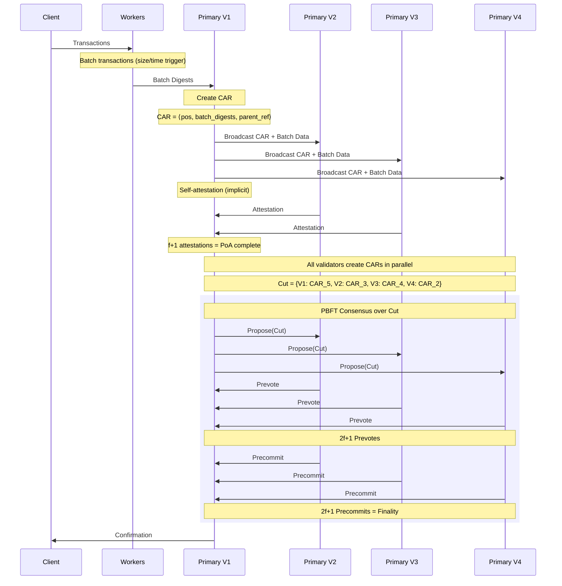

# ADR 004: Autobahn BFT with Worker Scaling

## Changelog

* 2025-12-06: Initial draft

## Status

PROPOSED Not Implemented

## Abstract

CipherBFT implements Autobahn BFT's Primary-Worker architecture for horizontal throughput scaling. Each validator runs:
- **Primary** (1-2 cores): Consensus (Malachite PBFT), CAR creation, attestation aggregation, Cut formation
- **Workers** (configurable 1-8): Transaction batching and data dissemination

This architecture achieves:
- **5 delta latency** (vs Narwhal's 9 delta)
- **~200K TPS baseline** with 1 worker
- **Linear scaling** with additional workers (requires validation)

---

## Background: Why Autobahn over Narwhal?

### The Two Real Options

| Aspect | Narwhal-Bullshark | Autobahn |
|--------|-------------------|----------|
| **Source** | [EuroSys '22](https://arxiv.org/abs/2105.11827), Sui Production | [SOSP '24](https://arxiv.org/abs/2401.10369) |
| **Architecture** | Primary-Worker | Primary-Worker |
| **Data Availability** | 2f+1 batch acks | f+1 CAR attestations |
| **Consensus** | DAG commit (Bullshark/Tusk) | PBFT (3-phase) |
| **Latency** | 9 delta | 5 delta |
| **Throughput (1 worker)** | 140K TPS | 199K TPS |
| **Worker Scaling** | Proven (140K → 600K) | Architecturally supported |
| **Battle-tested** | Yes (Sui) | No (Paper only) |

---

## Decision: Autobahn BFT

### Rationale

| Criterion | Narwhal-Bullshark | Autobahn | Winner |
|-----------|-------------------|----------|--------|
| Latency | 9 delta (~900ms) | 5 delta (~500ms) | Autobahn |
| Complexity | DAG + garbage collection | Linear lanes + PBFT | Autobahn |
| Throughput | 140K (1w) → 600K (10w) | 199K (1w), scaling TBD | Narwhal |
| Battle-tested | Sui production | Paper only | Narwhal |

**Decision**: Autobahn's latency advantage (nearly 2x) and simpler consensus model outweigh Narwhal's battle-tested status. Worker scaling must be validated empirically.

### Risk Mitigation

1. **Worker scaling uncertainty**: Benchmark with 1, 2, 4, 8 workers before production
2. **No production deployment**: Extensive testing, formal verification of critical paths
3. **Fallback**: If Autobahn worker scaling fails, Narwhal-Bullshark remains viable

---

## Architecture

### Validator Node Structure

```
┌─────────────────────────────────────────────────────────────────┐
│                     CipherBFT Validator Node                     │
├─────────────────────────────────────────────────────────────────┤
│  PRIMARY (1-2 cores)                                             │
│  ┌─────────────────────────────────────────────────────────────┐│
│  │  Malachite Consensus Engine (PBFT)                          ││
│  │  ├── CAR Creation: ⟨position, batch_digests, parent_ref⟩   ││
│  │  ├── Attestation Collection (f+1 including self)            ││
│  │  ├── Cut Formation (highest attested CAR per validator)     ││
│  │  └── Consensus over Cut                                      ││
│  └─────────────────────────────────────────────────────────────┘│
│                              ↑ batch digests                     │
│  ┌─────────────────────────────────────────────────────────────┐│
│  │  WORKERS (configurable: 1-8)                                 ││
│  │  ┌──────────┐ ┌──────────┐ ┌──────────┐ ┌──────────┐        ││
│  │  │ Worker 0 │ │ Worker 1 │ │ Worker 2 │ │ Worker 3 │        ││
│  │  │ ──────── │ │ ──────── │ │ ──────── │ │ ──────── │        ││
│  │  │ Batch TX │ │ Batch TX │ │ Batch TX │ │ Batch TX │        ││
│  │  │ Broadcast│ │ Broadcast│ │ Broadcast│ │ Broadcast│        ││
│  │  └──────────┘ └──────────┘ └──────────┘ └──────────┘        ││
│  └─────────────────────────────────────────────────────────────┘│
└─────────────────────────────────────────────────────────────────┘
```

### Protocol Flow



### Data Structures

```rust
/// CAR (Certified Available Record) - Autobahn's data unit
pub struct Car {
    /// Validator who created this CAR
    pub proposer: ValidatorId,
    /// Position in this validator's lane (monotonically increasing)
    pub position: u64,
    /// Batch digests from Workers
    pub batch_digests: Vec<BatchDigest>,
    /// Reference to previous CAR in this lane
    pub parent_ref: Option<Hash>,
    /// Proposer's signature over CAR contents
    pub signature: BlsSignature,
}

/// Digest of a Worker batch
pub struct BatchDigest {
    pub worker_id: u8,
    pub digest: Hash,
    pub tx_count: u32,
    pub byte_size: u32,
}

/// Attestation = vote that CAR data is available
pub struct Attestation {
    pub car_hash: Hash,
    pub car_position: u64,
    pub attester: ValidatorId,
    pub signature: BlsSignature,
}

/// Cut = snapshot of highest attested CARs across all validators
/// Implements Malachite's Value trait - Cut is the consensus unit
/// Validators without attested CARs are excluded (partial cut allowed)
pub struct Cut {
    pub height: Height,
    /// Map from validator to their highest attested CAR
    /// Not all validators required - offline/slow validators excluded
    pub cars: HashMap<ValidatorId, CarReference>,
}

pub struct CarReference {
    pub proposer: ValidatorId,
    pub position: u64,
    pub car_hash: Hash,
}
```

---

## Latency Analysis

### Theoretical Model

Let **delta (δ)** = one-way network delay (WAN: ~50-100ms)

| Protocol | Data Layer | Consensus Layer | Total |
|----------|------------|-----------------|-------|
| **Narwhal-HotStuff** | 2δ (batch + 2f+1 acks) + 1δ (DAG vertex) | 6δ (HotStuff 3-phase) | **9δ** |
| **Narwhal-Bullshark** | 2δ (batch + 2f+1 acks) + 1δ (DAG vertex) | 4δ (DAG commit, 2 rounds) | **7δ** |
| **Autobahn** | 1δ (CAR broadcast) + 1δ (f+1 attestations) | 3δ (PBFT 3-phase) | **5δ** |

### Why Autobahn is Faster

1. **f+1 vs 2f+1**: Autobahn needs f+1 attestations, Narwhal needs 2f+1 batch acks
2. **No DAG**: Autobahn uses linear lanes, no causal ordering requirements
3. **PBFT vs DAG commit**: 3-phase PBFT (3δ) < Bullshark commit rule (4δ)

### Measured Latency (from papers)

| Protocol | Configuration | Measured Latency |
|----------|---------------|------------------|
| Autobahn | 4 replicas, geo-distributed | **190ms** |
| Bullshark | 4 replicas, geo-distributed | 606ms |
| Narwhal-HotStuff | 4 validators, WAN | <2s |

**Autobahn achieves ~3x lower latency than Bullshark in practice.**

### Pipelining Effect

Autobahn pipelines attestation collection:
- During consensus on height N, collect attestations for height N+1
- Steady-state latency ≈ max(attestation_time, consensus_time)
- First transaction latency = attestation_time + consensus_time (5δ)

```
Height N:   [CAR] → [Attest] → [Consensus] → [Finalize]
Height N+1:         [CAR] → [Attest] → [Consensus] → [Finalize]
                    ├─ Overlap ─┤
```

### Consensus Abort Handling

If PBFT consensus aborts (max rounds exceeded):
- **Attestations are preserved** - they are bound to CAR positions, not consensus height
- Consensus retries with potentially updated Cut
- No need to re-collect attestations for already-attested CARs

---

## Throughput Analysis

### Benchmark Results (Consensus-Only, from Papers)

| Protocol | n | Workers | Peak TPS | Source |
|----------|---|---------|----------|--------|
| HotStuff (vanilla) | 10-20 | - | 1.8K | EuroSys '22 |
| HotStuff (batched) | 10 | - | 70K | EuroSys '22 |
| Narwhal-HotStuff | 4 | 1 | 140K | EuroSys '22 |
| Narwhal-HotStuff | 4 | 4 | ~400K | EuroSys '22 |
| Narwhal-HotStuff | 4 | 10 | ~600K | EuroSys '22 |
| Bullshark | 4 | 1 | 212K | SOSP '24 |
| **Autobahn** | 4 | 1 | **199K** | SOSP '24 |

### Worker Scaling (Narwhal, proven)

```
Workers  Throughput   Scaling
────────────────────────────────
1        140K TPS     1.0x
2        ~280K TPS    ~2.0x
4        ~400K TPS    ~2.9x
10       ~600K TPS    ~4.3x
```

**Key insight from Narwhal**: "The main cost of large-scale blockchain protocols is not consensus but reliable transaction dissemination."

### Autobahn Worker Scaling (to be validated)

Autobahn's architecture supports worker scaling, but the paper only benchmarks with 1 worker.

**Expected behavior** (requires empirical validation):
- Autobahn baseline: 199K TPS (1 worker)
- With 4 workers: ~400-600K TPS (projected, based on Narwhal scaling pattern)

**Validation plan**:
1. Benchmark with 1 worker → establish baseline
2. Benchmark with 2, 4, 8 workers → measure actual scaling
3. If sub-linear or no scaling → investigate bottlenecks

---

## f+1 Availability Guarantee

Autobahn uses f+1 attestations (including proposer's implicit self-attestation) instead of Narwhal's 2f+1 batch acks.

### Why f+1 is Sufficient

In a system with n = 3f+1 validators:
- f+1 attestations guarantee **at least 1 honest validator** has the data
- Worst case: f Byzantine validators attest falsely → 1 honest attestor remains
- If data needed during execution, honest holder provides via recovery protocol

### Attestation Requirement

**Validators must have batch data before attesting.** When receiving a CAR:
1. Check if all referenced batch digests are locally available
2. If missing, fetch from peer Workers
3. Only after data is confirmed, create and send attestation

This ensures f+1 attestations truly guarantee data availability.

### Trade-off

| Guarantee | Narwhal (2f+1) | Autobahn (f+1) |
|-----------|----------------|----------------|
| Honest holders | ≥ f+1 | ≥ 1 |
| Recovery | Rarely needed | More frequent |
| Latency | Higher (more acks) | Lower |

Autobahn trades stronger redundancy for lower latency. Safety is maintained because consensus cannot finalize unavailable data.

---

## Component Responsibilities

### Primary Process

```rust
pub struct Primary {
    /// Our validator identity
    our_id: ValidatorId,
    /// Signing key
    secret_key: BlsSecretKey,
    /// Current validator set
    validator_set: ValidatorSet,
    /// Malachite consensus engine
    consensus: MalachiteEngine,
    /// Data Chain Layer (Autobahn)
    dcl: DataChainLayer,
    /// Worker coordination
    worker_coordinator: WorkerCoordinator,
}

impl Primary {
    /// Main event loop
    pub async fn run(&mut self) {
        loop {
            select! {
                // Collect batches from workers
                batch = self.worker_coordinator.recv_batch() => {
                    self.dcl.add_batch(batch);
                }
                // Create CAR when ready
                _ = self.car_timer.tick() => {
                    if let Some(car) = self.dcl.create_car() {
                        self.broadcast_car(car).await;
                    }
                }
                // Handle incoming CAR from peer
                car = self.network.recv_car() => {
                    if let Some(attestation) = self.dcl.process_car(&car)? {
                        self.broadcast_attestation(attestation).await;
                    }
                }
                // Handle incoming attestation
                att = self.network.recv_attestation() => {
                    self.dcl.add_attestation(att)?;
                }
                // Consensus events from Malachite
                event = self.consensus.next_event() => {
                    self.handle_consensus_event(event).await;
                }
            }
        }
    }

    /// Form Cut and propose to consensus
    fn propose_cut(&mut self) -> Option<Cut> {
        self.dcl.form_cut(self.consensus.current_height())
    }
}
```

### Worker Process

Workers broadcast batches directly to peer Workers (other validators' Workers), not through Primary. This prevents Primary from becoming a bottleneck.

```rust
pub struct Worker {
    worker_id: u8,
    config: WorkerConfig,
    /// Pending transactions
    pending_txs: Vec<Transaction>,
    /// Channel to Primary (digests only)
    primary_tx: mpsc::Sender<BatchDigest>,
    /// Network for direct peer-to-peer batch broadcast
    peer_network: WorkerNetwork,
}

impl Worker {
    pub async fn run(&mut self) {
        loop {
            select! {
                // Receive transaction
                tx = self.network.recv_transaction() => {
                    self.pending_txs.push(tx);
                    if self.should_flush() {
                        self.create_and_broadcast_batch().await;
                    }
                }
                // Time-based flush
                _ = self.flush_timer.tick() => {
                    if !self.pending_txs.is_empty() {
                        self.create_and_broadcast_batch().await;
                    }
                }
                // Receive batch from peer worker
                batch = self.network.recv_peer_batch() => {
                    self.store_batch(batch);
                }
            }
        }
    }

    fn should_flush(&self) -> bool {
        self.pending_txs.len() >= self.config.max_batch_txs
            || self.batch_size() >= self.config.max_batch_bytes
    }

    async fn create_and_broadcast_batch(&mut self) {
        let batch = Batch {
            worker_id: self.worker_id,
            transactions: std::mem::take(&mut self.pending_txs),
            timestamp: now(),
        };
        let digest = batch.digest();

        // Broadcast to peer workers
        self.network.broadcast_batch(&batch).await;

        // Report digest to Primary
        self.primary_tx.send(BatchDigest {
            worker_id: self.worker_id,
            digest,
            tx_count: batch.transactions.len() as u32,
        }).await;
    }
}
```

---

## Malachite Integration

Cut is the consensus Value in Malachite:

```rust
impl malachite_common::Value for Cut {
    type Id = Hash;

    fn id(&self) -> Self::Id {
        self.hash()
    }
}

impl malachite_common::Context for CipherBftContext {
    type Value = Cut;
    // ... other associated types
}
```

### Consensus Flow

1. **Propose**: Leader forms Cut from highest attested CARs, proposes to Malachite
2. **Prevote**: Validators verify Cut validity (all referenced CARs have f+1 attestations)
3. **Precommit**: Validators commit to Cut
4. **Decide**: Cut finalized, all transactions in referenced CARs are ordered

### Partial Cut Rules

- Cut may exclude validators without attested CARs
- Minimum requirement: Cut must include at least 1 CAR
- Excluded validators can catch up in next height

---

## Configuration

```toml
[autobahn]
# Number of workers per validator (1-8)
worker_count = 4

# CAR creation interval
car_interval_ms = 100

# Attestation timeout (base, increases with backoff)
attestation_timeout_ms = 500
attestation_backoff_delta_ms = 250
max_attestation_timeout_ms = 5000

[worker]
# Batch size threshold (bytes)
max_batch_bytes = 1_000_000  # 1MB

# Batch transaction count threshold
max_batch_txs = 1000

# Time-based flush interval
flush_interval_ms = 100

# Worker restart policy
restart_delay_ms = 1000
max_restarts = 3
```

---

## Comparison: Final Decision

| Criterion | Narwhal-Bullshark | Autobahn | Decision |
|-----------|-------------------|----------|----------|
| **Latency** | 7-9 delta | 5 delta | Autobahn |
| **Measured latency** | 600ms-2s | 190ms | Autobahn |
| **Throughput (1w)** | 140K | 199K | Autobahn |
| **Worker scaling** | Proven | Supported (TBD) | Narwhal |
| **Complexity** | DAG + GC | Linear lanes | Autobahn |
| **Battle-tested** | Sui | Paper only | Narwhal |

**Final Decision**: **Autobahn BFT**

- Latency is critical for user experience
- Simpler consensus model reduces implementation risk
- Worker scaling must be validated, but architecture supports it
- Fallback to Narwhal-Bullshark if scaling fails

---

## Test Cases

1. **Latency measurement**: Verify <500ms consensus latency with 4 geo-distributed validators
2. **Throughput baseline**: Measure TPS with 1 worker
3. **Worker scaling**: Benchmark 1, 2, 4, 8 workers, verify scaling factor
4. **Attestation threshold**: Verify f+1 attestations trigger PoA
5. **Data recovery**: Verify missing batch recovery from honest holder
6. **Worker crash**: Verify graceful degradation with N-1 workers
7. **Pipelining**: Verify attestation overlap with consensus

## References

* [Autobahn BFT Paper](https://arxiv.org/abs/2401.10369) - SOSP '24
* [Autobahn Artifact](https://github.com/neilgiri/autobahn-artifact)
* [Narwhal Paper](https://arxiv.org/abs/2105.11827) - EuroSys '22
* [Malachite](https://github.com/informalsystems/malachite) - PBFT implementation
